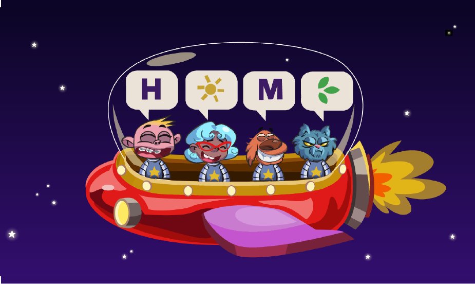
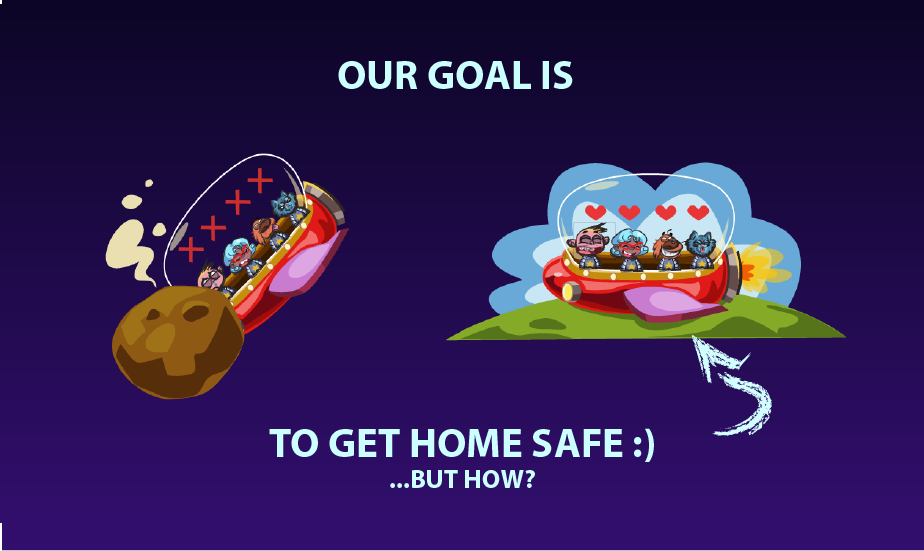
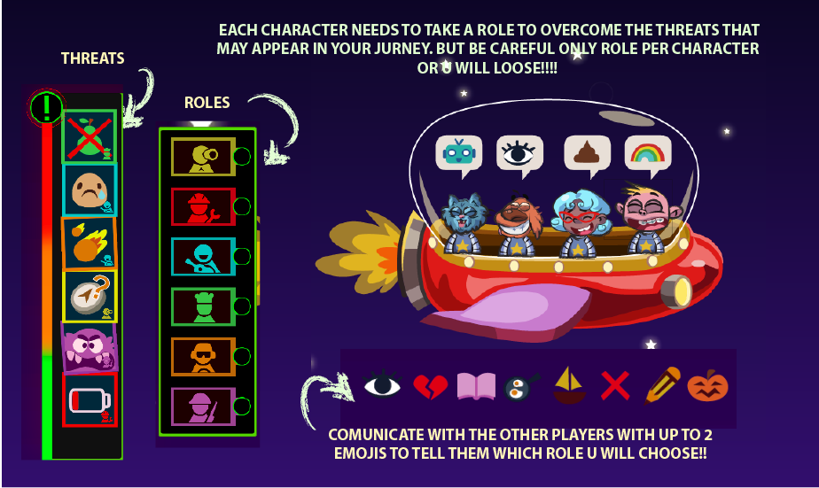
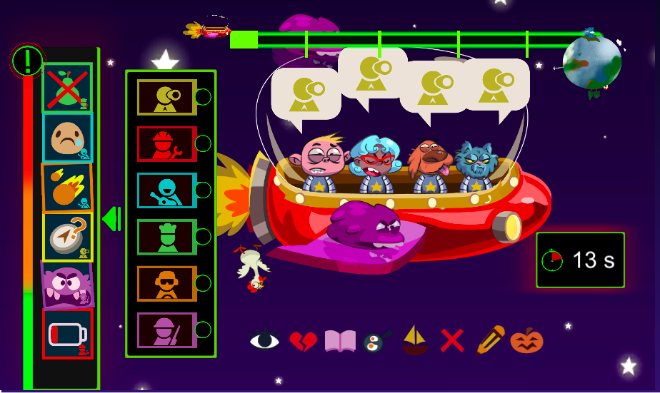
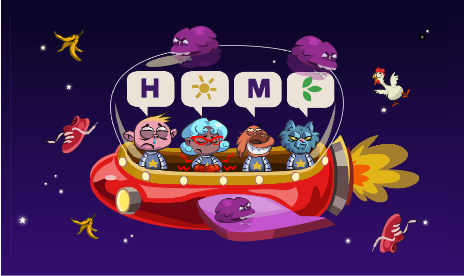

# global-game-jam-01-2019

This game was developed for the [Global Gamejam 2019](https://globalgamejam.org/), hosted at [InnoGames](https://igjam.eu/) headquarters.

Developed in Unity2018.3.3f1 and Java.

## Story

Screenshot of an advanced game.

Thank you for reading!

## Result

The game did not make it for the final deadline. We wanted a fully functional network game. Surprisingly that was up and running quite early, the most difficulty came from an open source library we used to allow everyone in the team to work on the logic and interface.

In the end the small difficulties and some added sickness made the game not due in time.

## Team

 - Niklas Baudy
 - Giancarlo Dessena
 - Oriana Laplana
 - Berta Laurin
 - Andy Michael
 - Sergio R. Lumley
 - Marta Viader
 - Luis Rojas Jimenez

## Development instructions

### Starting the server standalone locally
    cd server
    ./gradlew bootRun

or open the server project in the ide of your chouce and run
ServerApplication.kt#main

### Remote server address
https://ggj19.herokuapp.com/

